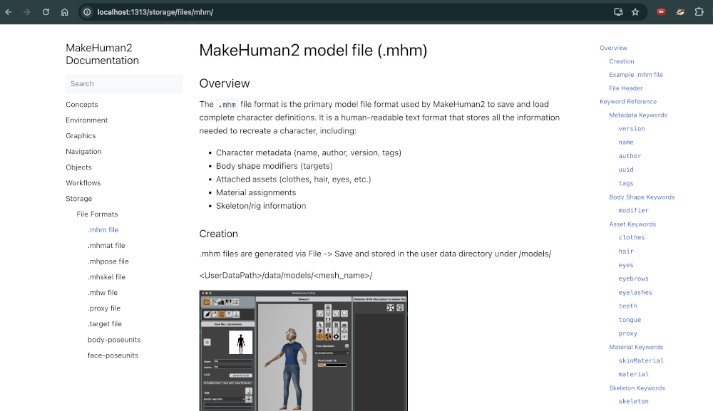

# Documentation Notes 

##### (in progress)

## Create a new Hugo site

```hugo new site . --force```

## Set the theme for Hugo

There are many themes to choose from - available via git. 

```git clone https://github.com/alex-shpak/hugo-book themes/hugo-book ```

<figure>
  
  <figcaption>'hugo book' theme</figcaption>
</figure>


## Show subdirectories

create an _index.md file in each of them you want to see, Hugo will pick up on it

## Launch Hugo Server

from a directory with a hugo config file

hugo server -D

then go to: localhost:1313

## Stop Hugo Server

pkill -f "hugo server"


## Open a 'Simple Browser' in VSCode

Command Palette: Cmd+Shift+P
type Simple Browser: Show
enter the url, e.g. localhost:1313

## Hugo config file

hugo.toml

Defines:
- site settings: base url, language and title
- 

## Hugo folders

### public/

The public folder is Hugo's **build output** - it contains the generated static HTML/CSS/JS files that are deployed to your web server. 

It's created when you run `hugo` (without the `server` flag). You can safely ignore it during development and add it to `.gitignore`.

### assets/

The assets folder is for source files that Hugo processes (SCSS, JS, images for resizing). Unlike static which serves files as-is, assets files can be transformed/optimized by Hugo. 

Currently empty, only needed if you add custom processed assets.

## resources/

The resources folder is Hugo's cache for processed assets (optimized images, compiled SCSS, etc.). Generated automatically, can be safely ignored and added to .gitignore.

## static/

The static folder holds files served as-is (images, fonts, your custom.css). Contents are copied directly to the site root without processing.

## themes/

Installed via git clone, e.g.


```git clone https://github.com/alex-shpak/hugo-book themes/hugo-book ```

or 

```
git clone https://github.com/theNewDynamic/gohugo-theme-ananke.git themes/ananke
```


## Place in-line images

you can put all the images in the 'static' folder with a path that matches your md file

or, just put it in the local folder and reference it directly

<figure>
  
  <figcaption>Hugo Weaving thinking about stuff</figcaption>
</figure>


