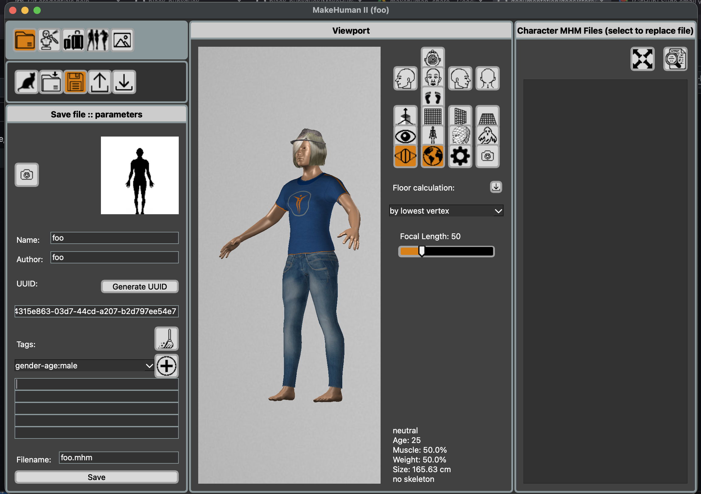

## .mhm file
# MakeHuman model file

## Overview

### What is an .mhm file?

An .mhm file stores parameters that define a character but not the geometry itself, rather like a recipe.

### Data model

Internally, an .mhm is a plain text file that records:

- Scalar values for macro- and micro-parameters

- Target activations and weights

- Configuration switches (modifiers, assets, materials)

- References to external target and asset definitions

- Body proportions (height, weight, gender balance, etc.)

- Applied targets and their values

- Skin, materials, and other appearance settings

- Modifier and configuration choices

### How .mhm files are used

When you load a .mhm file, MakeHuman2:

- Starts from the base human model

- Applies the stored parameters

- Reconstructs the character procedurally

### Creation

.mhm files are generated via File -> Save and stored in the user data directory under /models/

#### Windows
todo
#### MacOS
~/Documents/MakeHuman/v1py3/data/models/
#### Linux
todo

### Example .mhm file

\# MakeHuman2 Model File
version v2.0.1\
uuid 4e488d21-e948-4a72-afcc-7ea517d8d72d\
name foo\
tags example\
camera 27.5 324.5 0.0 0.0 0.0 1.0\
modifier breast/BreastSize 0.500000\
modifier breast/BreastFirmness 0.500000\
modifier macrodetails/Gender 0.500000\
modifier macrodetails/Age 0.500000\
modifier macrodetails/African 0.333333\
modifier macrodetails/Asian 0.333333\
modifier macrodetails/Caucasian 0.333333\
modifier macrodetails-universal/Muscle 0.500000\
modifier macrodetails-universal/Weight 0.500000\
modifier macrodetails-height/Height 0.500000\
modifier macrodetails-proportions/BodyProportions 0.500000\
eyes HighPolyEyes 2c12f43b-1303-432c-b7ce-d78346baf2e6\
clothesHideFaces True\
skinMaterial skins/default.mhmat\
material HighPolyEyes 2c12f43b-1303-432c-b7ce-d78346baf2e6 eyes/materials/brown.mhmat\
subdivide False

