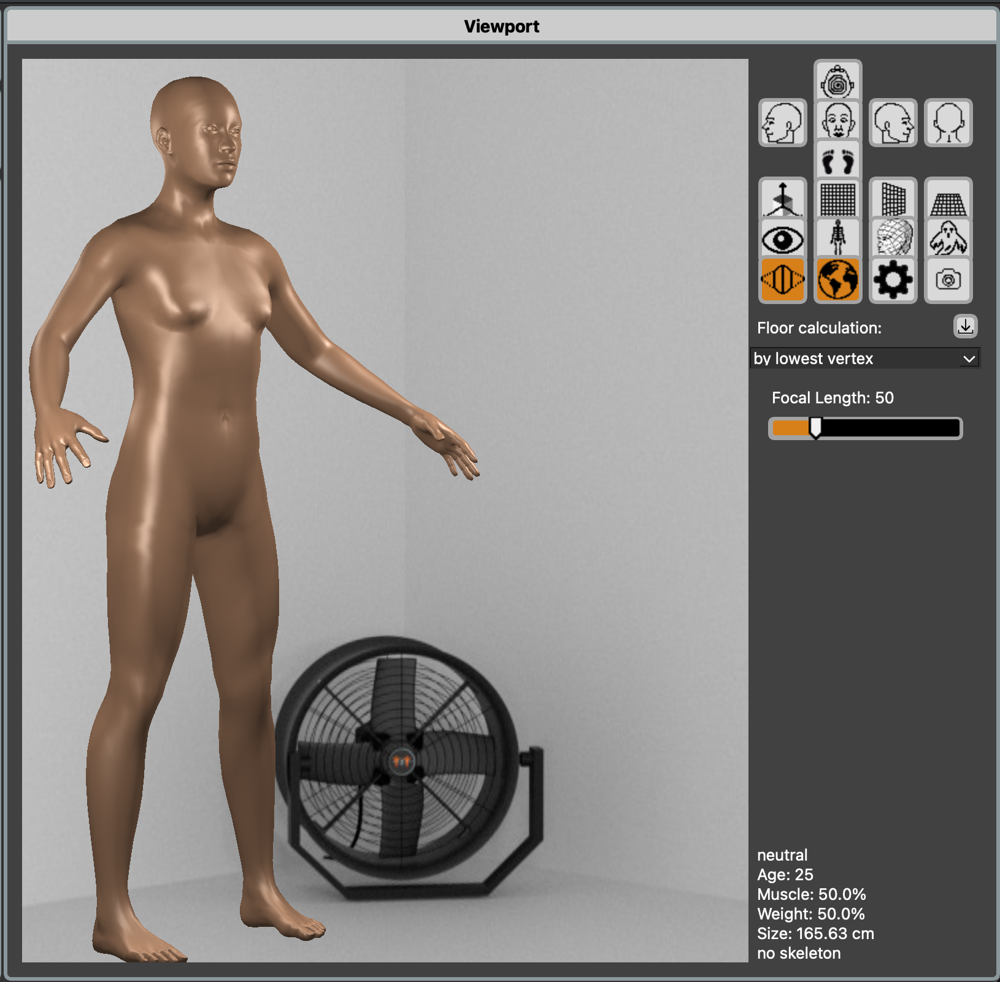
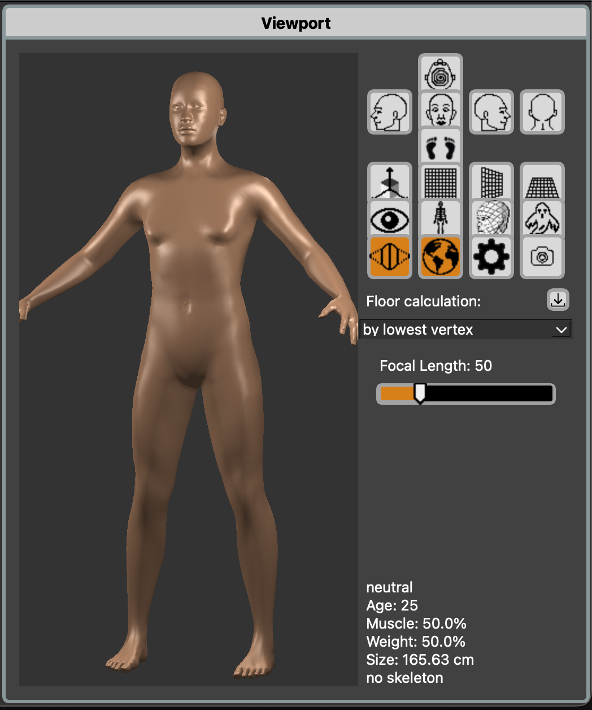
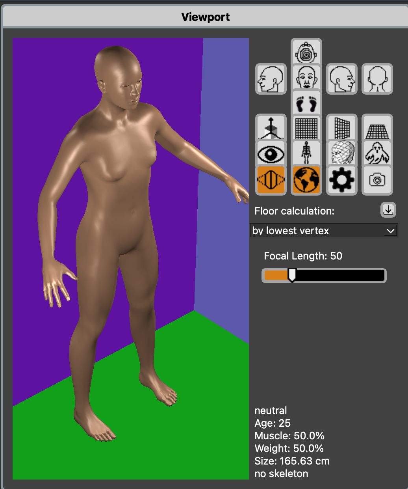

## shader.json
# Shader Configuration File

## Overview

The `shader.json` file is the global configuration file for MakeHuman2's rendering system. It defines the default lighting setup, rendering parameters, and visual environment settings that control how the 3D scene is rendered in the viewport.

This file controls:
- Background (clear) color
- Ambient lighting
- Specular lighting properties
- Lighting method (Phong vs Blinn-Phong)
- Skybox settings
- Up to 3 point/directional lights with positions, colors, and intensities

---

## File Location

**System Default:**

```text
<SystemDir>/data/shaders/shader.json
```

**User Override:**

Currently, `shader.json` does not support user overrides.

---

## File Format

The `shader.json` file uses standard JSON format:

```json
{
    "glclearcolor": [0.2, 0.2, 0.2, 1.0],
    "ambientcolor": [1.0, 1.0, 1.0, 0.35],
    "specularfocus": 30.0,
    "blinn": true,
    "skybox": true,
    "skyboxname": "default",
    "lamps": [
        { "position": [8.5, 8.0, 6.5], "color": [1.0, 1.0, 1.0, 7.0], "type": 0 },
        { "position": [-12.0, 6.0, 6.5], "color": [1.0, 1.0, 1.0, 8.0], "type": 0 },
        { "position": [-0.4, 7.0, -10.0], "color": [1.0, 1.0, 1.0, 5.0], "type": 0 }
    ]
}
```

---

## Configuration Fields

### `glclearcolor`

**Type:** Array of 4 floats [R, G, B, A]  
**Range:** 0.0 to 1.0 per channel  
**Default:** `[0.2, 0.2, 0.2, 1.0]` (dark gray)

The OpenGL clear color, which is the background color of the viewport when no skybox is active.

**Format:**
- Red, Green, Blue, Alpha values in range 0.0-1.0
- RGB values define the color
- Alpha is typically 1.0 (fully opaque)

**Example:**

```json
"glclearcolor": [0.2, 0.2, 0.2, 1.0]
```

**Common Values:**
- `[0.2, 0.2, 0.2, 1.0]` - Dark gray (default, neutral)
- `[0.0, 0.0, 0.0, 1.0]` - Black (for dramatic lighting)
- `[0.5, 0.5, 0.5, 1.0]` - Medium gray
- `[1.0, 1.0, 1.0, 1.0]` - White (for bright, studio-like environment)
- `[0.1, 0.2, 0.3, 1.0]` - Dark blue-gray (atmospheric)

---

### `ambientcolor`

**Type:** Array of 4 floats [R, G, B, Intensity]  
**Range:** 0.0 to 1.0 per channel  
**Default:** `[1.0, 1.0, 1.0, 0.35]`

Defines the ambient light color and intensity. Ambient light provides uniform illumination to all surfaces, preventing completely black shadows.

**Format:**
- First 3 values: RGB color (0.0-1.0)
- Fourth value: Intensity/luminance (0.0-1.0)
- Final ambient contribution = RGB × Intensity

**Example:**

```json
"ambientcolor": [1.0, 1.0, 1.0, 0.35]
```

This creates neutral white ambient light at 35% intensity.

**Common Values:**
- `[1.0, 1.0, 1.0, 0.35]` - Neutral white ambient (default)
- `[1.0, 1.0, 1.0, 0.25]` - Darker, more dramatic
- `[1.0, 1.0, 1.0, 0.50]` - Brighter, softer shadows
- `[1.0, 0.95, 0.90, 0.35]` - Warm tinted ambient
- `[0.90, 0.95, 1.0, 0.35]` - Cool tinted ambient

---

### `specularfocus`

**Type:** Float  
**Range:** 1.0 to 64.0  
**Default:** `30.0`

Controls the sharpness/size of specular highlights (shiny spots on surfaces). Higher values create smaller, sharper highlights; lower values create larger, softer highlights.

This value is the "shininess" exponent in the Phong/Blinn-Phong lighting model.

**Example:**

```json
"specularfocus": 30.0
```

**Common Values:**
- `1.0-5.0` - Very soft, broad highlights (rubber, matte plastic)
- `10.0-20.0` - Moderate highlights (painted surfaces, semi-gloss)
- `30.0` - Default (balanced for skin and general materials)
- `40.0-64.0` - Sharp, tight highlights (glossy surfaces, wet skin, polished metal)

**Effect:**
- Lower = Broader, softer specular highlights
- Higher = Tighter, sharper specular highlights

---

### `blinn`

**Type:** Boolean  
**Default:** `true`

Selects between Blinn-Phong and standard Phong specular lighting calculation.

**Values:**
- `true` - Use Blinn-Phong (more physically accurate, recommended)
- `false` - Use standard Phong (legacy, may look different)

**Difference:**

- **Phong:** Uses reflection vector
  - `specular = pow(max(dot(reflect_dir, view_dir), 0.0), shininess)`
  
- **Blinn-Phong:** Uses halfway vector
  - `specular = pow(max(dot(normal, halfway), 0.0), shininess)`

Blinn-Phong generally produces more consistent and realistic highlights, especially at grazing angles.

**Example:**

```json
"blinn": true
```

---

### `skybox`

**Type:** Boolean  
**Default:** `true`

Enables or disables the skybox (environment cubemap).

**Values:**
- `true` - Skybox is rendered as background and provides environment reflections
- `false` - Skybox disabled, `glclearcolor` is used as background

**Example:**

```json
"skybox": true
```

**Effect:**
- When `true`: 360° environment background, provides reflections for PBR materials
- When `false`: Solid color background (from `glclearcolor`)

<div style="display: flex; justify-content: space-around;">
  
  
</div>


---

### `skyboxname`

**Type:** String  
**Default:** `"default"`

Specifies which skybox to use when skybox rendering is enabled.

**Format:**
- Name of a directory in `data/shaders/skybox/`
- Directory must contain 6 cubemap face images (px, nx, py, ny, pz, nz)

**Example:**

```json
"skyboxname": "default"
```

**Available Skyboxes:**

Skyboxes are stored in `data/shaders/skybox/<name>/` with files:
- `posx.jpg` or `posx.png` - Positive X (right)
- `negx.jpg` or `negx.png` - Negative X (left)
- `posy.jpg` or `posy.png` - Positive Y (up)
- `negy.jpg` or `negy.png` - Negative Y (down)
- `posz.jpg` or `posz.png` - Positive Z (front)
- `negz.jpg` or `negz.png` - Negative Z (back)

**Notes:**
- Files can be either `.jpg` or `.png` format
- All 6 faces must be present for a valid skybox
- Images should be square (typically 2048×2048 pixels)

**Common Skyboxes:**
- `"default"` - Standard skybox (if available)
- Custom skybox names based on available directories

<figure>
  
  <figcaption>Viewport with custom skybox</figcaption>
</figure>


---

### `lamps`

**Type:** Array of light objects  
**Maximum:** 3 lights  
**Default:** 3 point lights at different positions

Defines the scene's light sources. MakeHuman2 supports up to 3 simultaneous lights, each with configurable position, color, intensity, and type.

**Array Structure:**

```json
"lamps": [
    {
        "position": [8.5, 8.0, 6.5],
        "color": [1.0, 1.0, 1.0, 7.0],
        "type": 0
    },
    {
        "position": [-12.0, 6.0, 6.5],
        "color": [1.0, 1.0, 1.0, 8.0],
        "type": 0
    },
    {
        "position": [-0.4, 7.0, -10.0],
        "color": [1.0, 1.0, 1.0, 5.0],
        "type": 0
    }
]
```

#### Light Object Properties

##### `position`

**Type:** Array of 3 floats [X, Y, Z]  
**Meaning:** World-space coordinates or direction vector

For **point lights (type 0):**
- Position in 3D space where the light is located
- Light radiates from this point in all directions
- Distance affects attenuation

For **directional lights (type 1):**
- Direction vector (not position)
- Simulates infinitely distant light source
- No distance attenuation (like sunlight)

**Example:**

```json
"position": [8.5, 8.0, 6.5]
```

This places a light at X=8.5, Y=8.0 (height), Z=6.5.

##### `color`

**Type:** Array of 4 floats [R, G, B, Intensity]  
**Range:** 0.0-1.0 for RGB, variable for intensity

Defines the light's color and brightness.

**Format:**
- First 3 values: RGB color (0.0-1.0)
- Fourth value: Intensity/range
  - For point lights: affects attenuation distance
  - For directional lights: affects brightness
  - Typical range: 1.0-10.0

**Example:**

```json
"color": [1.0, 1.0, 1.0, 7.0]
```

This creates a white light with intensity 7.0.

**Common Colors:**
- `[1.0, 1.0, 1.0, 7.0]` - Neutral white
- `[1.0, 0.95, 0.85, 7.0]` - Warm white (tungsten)
- `[0.85, 0.90, 1.0, 7.0]` - Cool white (daylight)
- `[1.0, 0.80, 0.60, 5.0]` - Orange (sunset)
- `[0.95, 0.85, 0.70, 6.0]` - Warm studio light

##### `type`

**Type:** Integer (0 or 1)  
**Values:**
- `0` - Point light (omnidirectional, position-based)
- `1` - Directional light (parallel rays, direction-based)

**Example:**

```json
"type": 0
```

**Point Light (type 0):**
- Light radiates from a specific point
- Intensity decreases with distance (inverse square law)
- Good for: lamps, bulbs, candles, local illumination
- Attenuation: `intensity / (distance * distance)`

**Directional Light (type 1):**
- Light rays are parallel
- No distance attenuation
- Position vector treated as direction
- Good for: sun, moon, distant light sources
- Attenuation: `intensity / 4.0` (constant)

---

## Default Configuration

The default `shader.json` provides a three-light setup suitable for character modeling:

```json
{
    "glclearcolor": [0.2, 0.2, 0.2, 1.0],
    "ambientcolor": [1.0, 1.0, 1.0, 0.35],
    "specularfocus": 30.0,
    "blinn": true,
    "skybox": true,
    "skyboxname": "default",
    "lamps": [
        { "position": [8.5, 8.0, 6.5], "color": [1.0, 1.0, 1.0, 7.0], "type": 0 },
        { "position": [-12.0, 6.0, 6.5], "color": [1.0, 1.0, 1.0, 8.0], "type": 0 },
        { "position": [-0.4, 7.0, -10.0], "color": [1.0, 1.0, 1.0, 5.0], "type": 0 }
    ]
}
```

**Lighting Setup:**
- **Light 1:** Right-front key light (intensity 7.0)
- **Light 2:** Left-front fill light (intensity 8.0)
- **Light 3:** Back rim light (intensity 5.0)
- 35% ambient light for shadow fill

This creates a balanced three-point lighting setup typical for character work.

---


---

## Summary

The `shader.json` file is the central configuration for MakeHuman2's lighting and rendering environment. It provides control over:

- Background color and skybox
- Ambient lighting
- Specular highlights
- Up to 3 configurable lights (point or directional)
- Lighting calculation method (Phong/Blinn-Phong)

### Sample shader.json file

[shader.json](shader.json)

