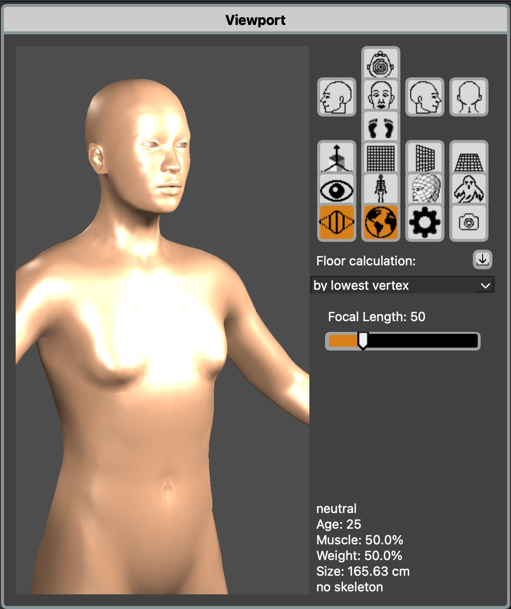
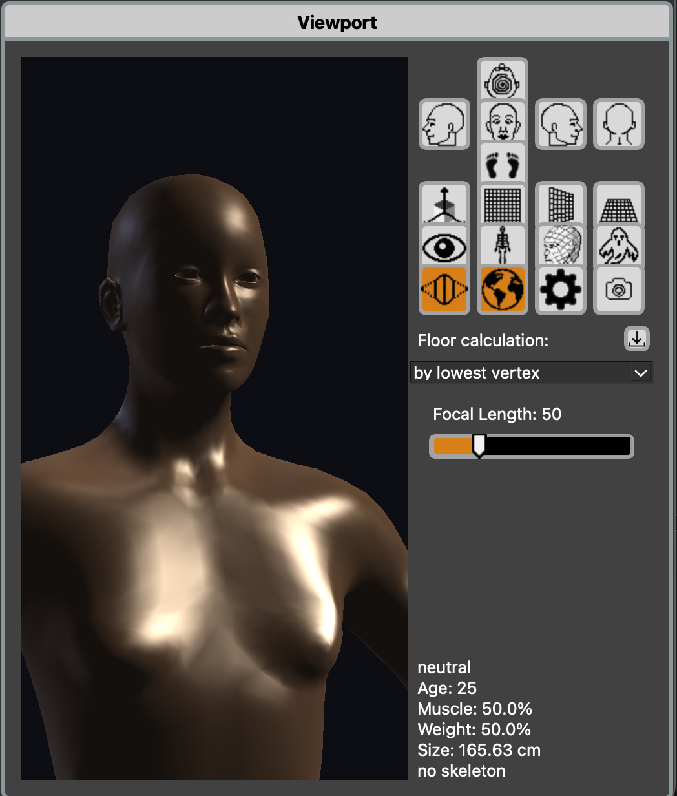
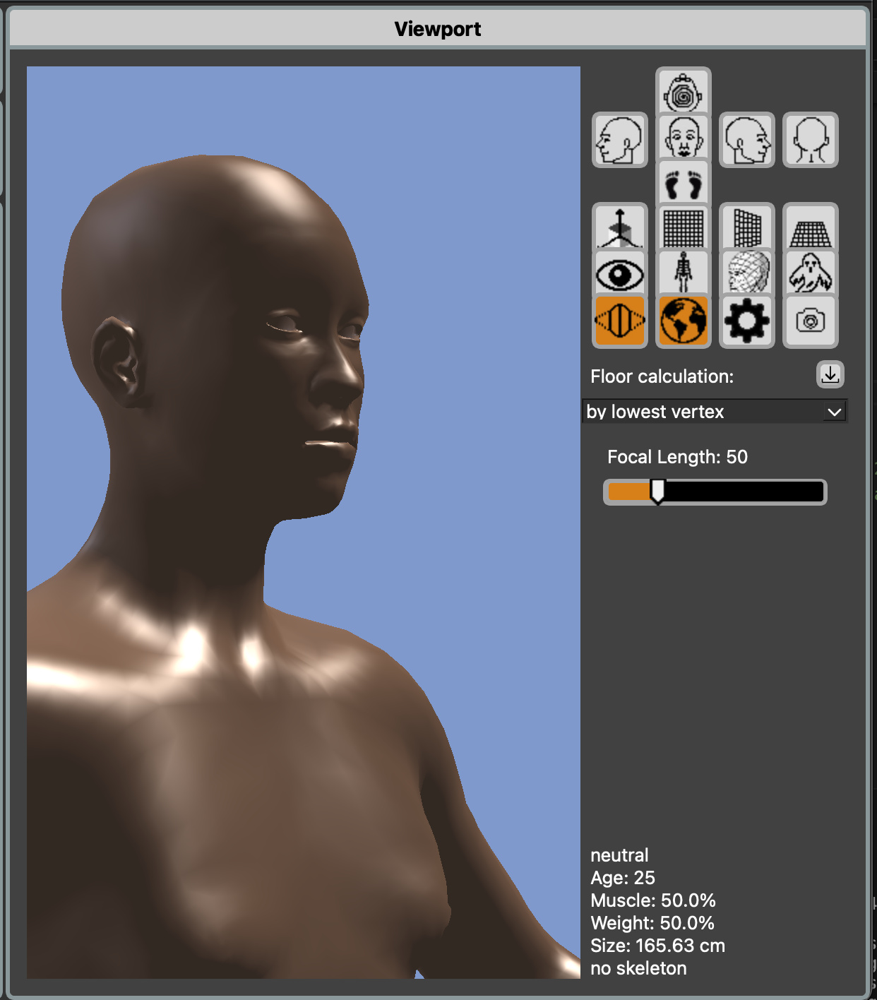
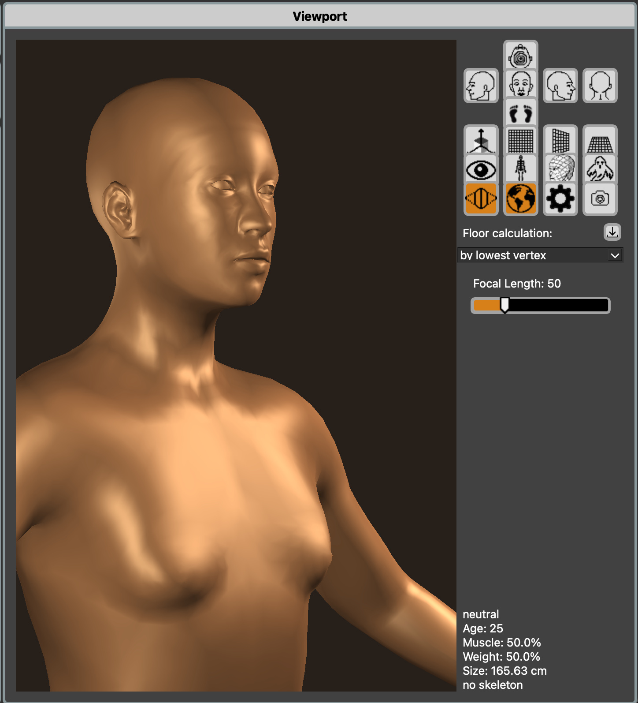
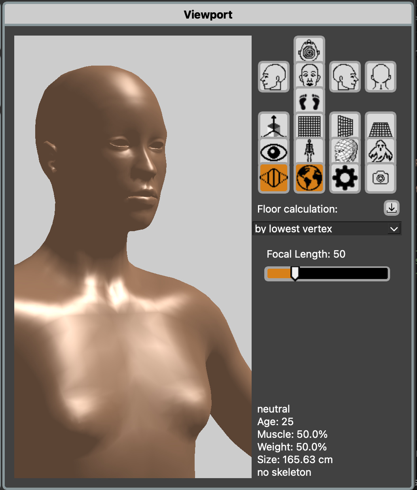
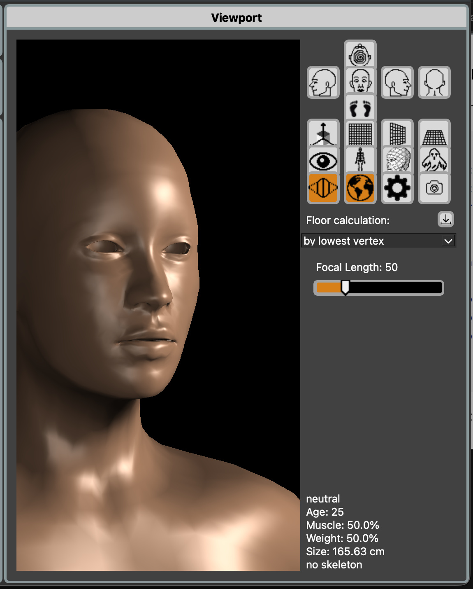
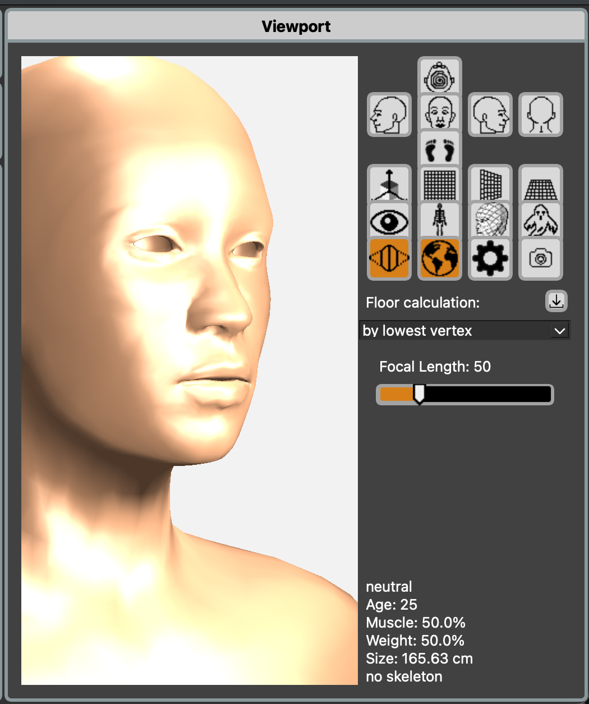

# Customizing Shaders


## Integration with Shaders

The `shader.json` configuration is read during initialization and passed as uniform variables to the fragment shaders.

### Loading Process

1. **Initialization:** `core/globenv.py` reads `shader.json` via `readShaderInitJSON()`
2. **Storage:** Settings stored in `glob.shaderInit`
3. **Light Setup:** `opengl/camera.py` creates `Light` object with these settings
4. **Shader Uniforms:** Values passed to shaders via `setShader()` method

### Shader Uniform Mapping

The configuration values are passed to GLSL shaders as uniforms:

| JSON Field | GLSL Uniform | Type | Shaders |
| --- | --- | --- | --- |
| `ambientcolor` | `ambientLight` | `vec4` | phong, pbr, toon |
| `specularfocus` | `lightWeight.y` | `float` | phong |
| `blinn` | `blinn` | `bool` | phong |
| `lamps[i].position` | `pointLights[i].position` | `vec3` | phong, pbr, toon |
| `lamps[i].color` | `pointLights[i].color` | `vec3` | phong, pbr, toon |
| `lamps[i].color[3]` | `pointLights[i].intensity` | `float` | phong, pbr, toon |
| `lamps[i].type` | `pointLights[i].type` | `int` | phong, pbr, toon |
| `skybox` | `useSky` | `bool` | pbr |
| `glclearcolor` | Used for `glClearColor()` | - | OpenGL |

### Affected Shaders

The configuration affects these shaders:
- **`phong.frag`** - All lighting settings, specular focus, Blinn toggle
- **`pbr.frag`** - Lighting, ambient, skybox reflections
- **`toon.frag`** - Lighting for cel shading
- **`litsphere.frag`** - Minimal (mostly uses lit-sphere texture)
---

## Alternate Lighting Scenarios

### Studio Portrait Lighting

Bright, even lighting for detailed character work:

```json
{
    "glclearcolor": [0.3, 0.3, 0.3, 1.0],
    "ambientcolor": [1.0, 1.0, 1.0, 0.45],
    "specularfocus": 32.0,
    "blinn": true,
    "skybox": false,
    "skyboxname": "default",
    "lamps": [
        { "position": [6.0, 8.0, 8.0], "color": [1.0, 1.0, 1.0, 10.0], "type": 0 },
        { "position": [-6.0, 8.0, 8.0], "color": [1.0, 1.0, 1.0, 10.0], "type": 0 },
        { "position": [0.0, 10.0, -8.0], "color": [1.0, 1.0, 1.0, 6.0], "type": 0 }
    ]
}
```

**Characteristics:**
- Higher ambient light (45%)
- Bright, symmetrical key lights
- Moderate backlight
- Neutral gray background
- Good for detailed inspection

<figure>
  
</figure>


### Dramatic Lighting

Low ambient, strong directional light for mood:

```json
{
    "glclearcolor": [0.05, 0.05, 0.08, 1.0],
    "ambientcolor": [0.9, 0.95, 1.0, 0.15],
    "specularfocus": 40.0,
    "blinn": true,
    "skybox": false,
    "skyboxname": "default",
    "lamps": [
        { "position": [1.0, 0.8, 0.5], "color": [1.0, 0.95, 0.85, 8.0], "type": 1 },
        { "position": [-0.5, 0.3, -0.8], "color": [0.6, 0.7, 1.0, 3.0], "type": 1 },
        { "position": [0.0, 8.0, 0.0], "color": [1.0, 1.0, 1.0, 0.5], "type": 0 }
    ]
}
```

**Characteristics:**
- Low ambient light (15%)
- Directional sun-like key light (warm)
- Cool fill light
- Minimal top light
- Dark background
- Strong shadows, high contrast

<figure>
  
</figure>


### Outdoor/Natural Lighting

Simulates sunlight and sky:

```json
{
    "glclearcolor": [0.5, 0.6, 0.8, 1.0],
    "ambientcolor": [0.85, 0.90, 1.0, 0.40],
    "specularfocus": 28.0,
    "blinn": true,
    "skybox": false,
    "skyboxname": "default",
    "lamps": [
        { "position": [0.5, 1.0, 0.3], "color": [1.0, 0.98, 0.95, 9.0], "type": 1 },
        { "position": [-0.3, 0.4, -0.6], "color": [0.7, 0.8, 1.0, 2.0], "type": 1 },
        { "position": [0.0, 8.0, 0.0], "color": [1.0, 1.0, 1.0, 0.0], "type": 0 }
    ]
}
```

**Characteristics:**
- Directional sun (warm, type 1)
- Cool sky fill light (blue tint)
- Light blue-gray background
- Cool-tinted ambient
- Third light disabled (intensity 0)

<figure>
  
</figure>


### Warm Interior Lighting

Indoor tungsten/warm lighting:

```json
{
    "glclearcolor": [0.15, 0.12, 0.10, 1.0],
    "ambientcolor": [1.0, 0.90, 0.75, 0.30],
    "specularfocus": 25.0,
    "blinn": true,
    "skybox": false,
    "skyboxname": "default",
    "lamps": [
        { "position": [8.0, 9.0, 5.0], "color": [1.0, 0.85, 0.65, 8.0], "type": 0 },
        { "position": [-8.0, 7.0, 5.0], "color": [1.0, 0.90, 0.70, 6.0], "type": 0 },
        { "position": [0.0, 6.0, -8.0], "color": [1.0, 0.88, 0.68, 4.0], "type": 0 }
    ]
}
```

**Characteristics:**
- Warm orange/yellow color temperature
- Warm-tinted ambient
- Point lights for natural falloff
- Dark warm-tinted background
- Cozy interior feel

<figure>
  
</figure>

---

## Example Configurations

### Minimal Lighting

Single directional light for fastest rendering:

```json
{
    "glclearcolor": [0.8, 0.8, 0.8, 1.0],
    "ambientcolor": [1.0, 1.0, 1.0, 0.60],
    "specularfocus": 30.0,
    "blinn": true,
    "skybox": false,
    "skyboxname": "default",
    "lamps": [
        { "position": [0.5, 1.0, 0.5], "color": [1.0, 1.0, 1.0, 6.0], "type": 1 },
        { "position": [0.0, 0.0, 0.0], "color": [1.0, 1.0, 1.0, 0.0], "type": 0 },
        { "position": [0.0, 0.0, 0.0], "color": [1.0, 1.0, 1.0, 0.0], "type": 0 }
    ]
}
```

<figure>
  
</figure>


### High-Contrast Fashion Lighting

Strong key, minimal fill:

```json
{
    "glclearcolor": [0.0, 0.0, 0.0, 1.0],
    "ambientcolor": [1.0, 1.0, 1.0, 0.10],
    "specularfocus": 45.0,
    "blinn": true,
    "skybox": false,
    "skyboxname": "default",
    "lamps": [
        { "position": [10.0, 10.0, 8.0], "color": [1.0, 1.0, 1.0, 12.0], "type": 0 },
        { "position": [-4.0, 6.0, 8.0], "color": [1.0, 1.0, 1.0, 3.0], "type": 0 },
        { "position": [0.0, 8.0, -12.0], "color": [1.0, 1.0, 1.0, 8.0], "type": 0 }
    ]
}
```

<figure>
  
</figure>


### Soft Portrait Lighting

Even, flattering lighting for portraits:

```json
{
    "glclearcolor": [0.95, 0.95, 0.95, 1.0],
    "ambientcolor": [1.0, 0.98, 0.95, 0.50],
    "specularfocus": 22.0,
    "blinn": true,
    "skybox": false,
    "skyboxname": "default",
    "lamps": [
        { "position": [5.0, 8.0, 10.0], "color": [1.0, 0.98, 0.95, 9.0], "type": 0 },
        { "position": [-5.0, 8.0, 10.0], "color": [1.0, 0.98, 0.95, 9.0], "type": 0 },
        { "position": [0.0, 12.0, 0.0], "color": [1.0, 1.0, 1.0, 5.0], "type": 0 }
    ]
}
```

<figure>
  
</figure>

